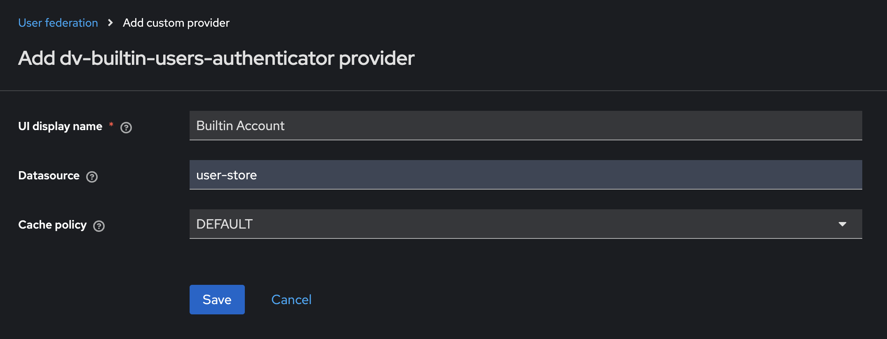
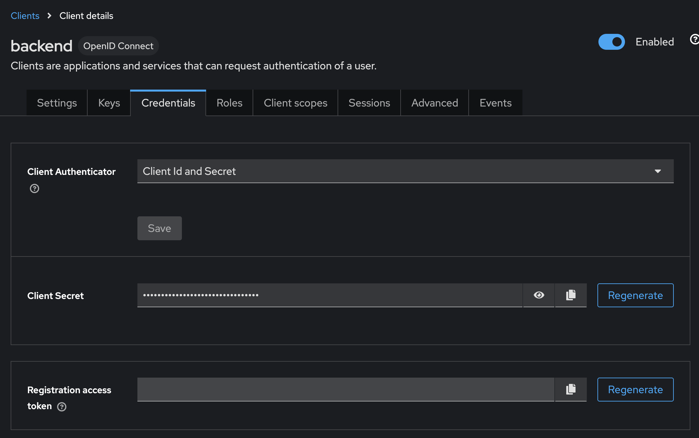

# Keycloak Instance Deployment

This guide walks you through the process of deploying and configuring a Keycloak instance to support authentication for Dataverse’s Single Page Application (SPA) built-in users.

### Download Keycloak

Install [Keycloak](https://www.keycloak.org/downloads.html) from the official website. Download a ZIP file that you'll need to place and unzip into the target instance.

### Download JDBC Drivers

Download the following Java Database Connectivity (JDBC) drivers from the URLs below, and place the downloaded `.jar` files in the `keycloak-26.X.X/providers` directory:

- [ojdbc11-23.7.0.25.01.jar](https://repo1.maven.org/maven2/com/oracle/database/jdbc/ojdbc11/23.7.0.25.01/ojdbc11-23.7.0.25.01.jar)
- [orai18n-23.7.0.25.01.jar](https://repo1.maven.org/maven2/com/oracle/database/nls/orai18n/23.7.0.25.01/orai18n-23.7.0.25.01.jar)

These drivers are required for the Keycloak SPI that you are going to install.

### Add Builtin Users SPI

Download the JAR file from [this link](https://github.com/IQSS/dataverse-frontend/blob/develop/dev-env/keycloak/keycloak-dv-builtin-users-authenticator-1.0-SNAPSHOT.jar), which contains the Builtin User SPI, and place it in the `keycloak-26.X.X/providers` directory.

### Add Keycloak Custom Theme

Make sure you have **Maven** installed on your localhost.

Within the ``dataverse-frontend`` repository, run the following command to build the custom Keycloak theme:

   ```bash
   npm run build-keycloak-theme
   ```

Copy the generated ``dv-spa-kc-theme.jar`` file to your Keycloak instance’s ``keycloak-26.X.X/providers`` directory.

### Create quarkus.properties

Inside the ``keycloak-26.X.X/conf`` directory, create the following file, replacing the bracketed variables with the corresponding values for the Dataverse database that the SPI will access.

```properties
quarkus.datasource.user-store.db-kind=postgresql
quarkus.datasource.user-store.jdbc.url=jdbc:postgresql://<SERVER_IP>:<SERVER_PORT>/<DB_NAME>
quarkus.datasource.user-store.username=<DB_USERNAME>
quarkus.datasource.user-store.password=<DB_PASSWORD>

quarkus.datasource.user-store.jdbc.driver=org.postgresql.Driver
quarkus.datasource.user-store.jdbc.transactions=disabled
quarkus.transaction-manager.unsafe-multiple-last-resources=allow

quarkus.datasource.user-store.jdbc.recovery.username=<DB_USERNAME>
quarkus.datasource.user-store.jdbc.recovery.password=<DB_PASSWORD>

quarkus.datasource.user-store.jdbc.xa-properties.serverName=<SERVER_IP>
quarkus.datasource.user-store.jdbc.xa-properties.portNumber=<SERVER_PORT>
quarkus.datasource.user-store.jdbc.xa-properties.databaseName=<DB_NAME>
```

### SSL configuration

To enable SSL in Keycloak, you first need to add the required SSL certificates and private keys to the instance. Specifically, the following files should be added:

- `/etc/ssl/certs/<CER_NAME>.cer`
- `/etc/pki/tls/private/<KEY_NAME>.key`

Remember to update these routes with your actual file names.

Once the certificate and key have been uploaded to the instance, you need to configure the following Keycloak environment variables:

- `KC_HTTPS_CERTIFICATE_FILE=/etc/ssl/certs/<CER_NAME>.cer`
- `KC_HTTPS_CERTIFICATE_KEY_FILE=/etc/pki/tls/private/<KEY_NAME>.key`
- `KC_HTTPS_ENABLED=true`
- `KC_HTTPS_PORT=443`

### Running Keycloak

Run Keycloak for the first time on the instance using the following command. 

```bash
nohup ./bin/kc.sh start --bootstrap-admin-username tmpadm --bootstrap-admin-password pass --hostname https://<KEYCLOAK_DOMAIN> > keycloak.log 2>&1 &
```

This command will set up an admin user so you can log in and create a permanent one from the Keycloak Admin Console:  
`https://<KEYCLOAK_DOMAIN>/admin/master/console/`.

For subsequent executions of Keycloak, you can use the following command omitting the admin user bootstrapping parameters:

```bash
nohup ./bin/kc.sh start --hostname https://<KEYCLOAK_DOMAIN> > keycloak.log 2>&1 &2>&1 &
```

Note that the output logs of the command are saved in a file named ``keycloak.log``.

### Create a Keycloak Realm

Create a Realm in Keycloak from the Keycloak Admin Console:  
`https://<KEYCLOAK_DOMAIN>/admin/master/console/`. 

Give it a descriptive name for the environment you are deploying, since this name will appear in the different URLs used for OIDC and other purposes.

### Enable Builtin Users SPI

Once you have created the Realm, you need to enable the Builtin Users SPI within it. To do this, you can edit the following script with the admin credentials and realm name, and execute it.

```bash
#!/bin/sh

# Obtain admin token
ADMIN_TOKEN=$(curl -k -s -X POST "https://localhost:443/realms/master/protocol/openid-connect/token" \
  -H "Content-Type: application/x-www-form-urlencoded" \
  -d "username=<ADMIN_USERNAME>" \
  -d "password=<ADMIN_PASSWORD>" \
  -d "grant_type=password" \
  -d "client_id=admin-cli" | jq -r .access_token)
echo $ADMIN_TOKEN
# Create user storage provider using the components endpoint
curl -k -X POST "https://localhost:443/admin/realms/<REALM_NAME>/components" \
  -H "Authorization: Bearer $ADMIN_TOKEN" \
  -H "Content-Type: application/json" \
  -d '{
    "name": "Dataverse built-in users authentication",
    "providerId": "dv-builtin-users-authenticator",
    "providerType": "org.keycloak.storage.UserStorageProvider",
    "parentId": null
  }'

echo "Keycloak SPI configured in realm."
```

Now you have to register the provider within the Realm you created in Keycloak. 

To do this, go to **User Federation** and click on **Add custom provider**. The option **Add dv-builtin-users-authenticator provider** should appear.



Remember to set the datasource name **user-store**, which is the one specified in **quarkus.properties**.

### Create a Keycloak client for the Dataverse SPA

To allow the SPA to authenticate with Keycloak using PKCE, we need to create a public OIDC client in the Keycloak Realm.  

You can create a JSON file based on the following example file, replacing the value of the dataverse domain name with that of your installation, and use the **Import Client** option in Keycloak to create the client from a JSON file.

```json
{
  "clientId": "spa",
  "name": "",
  "description": "",
  "rootUrl": "",
  "adminUrl": "",
  "baseUrl": "",
  "surrogateAuthRequired": false,
  "enabled": true,
  "alwaysDisplayInConsole": false,
  "clientAuthenticatorType": "client-secret",
  "redirectUris": [
    "https://<INSTALLATION_DOMAIN_NAME>/spa/*"
  ],
  "webOrigins": [
    "+"
  ],
  "notBefore": 0,
  "bearerOnly": false,
  "consentRequired": false,
  "standardFlowEnabled": true,
  "implicitFlowEnabled": false,
  "directAccessGrantsEnabled": true,
  "serviceAccountsEnabled": false,
  "publicClient": true,
  "frontchannelLogout": true,
  "protocol": "openid-connect",
  "attributes": {
    "realm_client": "false",
    "oidc.ciba.grant.enabled": "false",
    "backchannel.logout.session.required": "true",
    "post.logout.redirect.uris": "+",
    "oauth2.device.authorization.grant.enabled": "false",
    "backchannel.logout.revoke.offline.tokens": "false"
  },
  "authenticationFlowBindingOverrides": {},
  "fullScopeAllowed": true,
  "nodeReRegistrationTimeout": -1,
  "defaultClientScopes": [
    "web-origins",
    "acr",
    "roles",
    "profile",
    "basic",
    "email"
  ],
  "optionalClientScopes": [
    "address",
    "phone",
    "offline_access",
    "microprofile-jwt"
  ],
  "access": {
    "view": true,
    "configure": true,
    "manage": true
  }
}
```

You can also create the client from scratch using the Keycloak UI.

### Create a Keycloak client for the Dataverse Backend

In the case of the backend client, you will need to create a Keycloak OIDC confidential client.

Below is a JSON file that you can import to set up the client.

```json
{
  "clientId": "backend",
  "name": "",
  "description": "",
  "rootUrl": "",
  "adminUrl": "",
  "baseUrl": "",
  "surrogateAuthRequired": false,
  "enabled": true,
  "alwaysDisplayInConsole": false,
  "clientAuthenticatorType": "client-secret",
  "redirectUris": [
    "*"
  ],
  "webOrigins": [],
  "notBefore": 0,
  "bearerOnly": false,
  "consentRequired": false,
  "standardFlowEnabled": true,
  "implicitFlowEnabled": false,
  "directAccessGrantsEnabled": true,
  "serviceAccountsEnabled": false,
  "publicClient": false,
  "frontchannelLogout": true,
  "protocol": "openid-connect",
  "attributes": {
    "realm_client": "false",
    "oidc.ciba.grant.enabled": "false",
    "client.secret.creation.time": "1747655394",
    "backchannel.logout.session.required": "true",
    "post.logout.redirect.uris": "+",
    "oauth2.device.authorization.grant.enabled": "false",
    "backchannel.logout.revoke.offline.tokens": "false"
  },
  "authenticationFlowBindingOverrides": {},
  "fullScopeAllowed": true,
  "nodeReRegistrationTimeout": -1,
  "defaultClientScopes": [
    "web-origins",
    "acr",
    "profile",
    "roles",
    "basic",
    "email"
  ],
  "optionalClientScopes": [
    "address",
    "phone",
    "organization",
    "offline_access",
    "microprofile-jwt"
  ],
  "access": {
    "view": true,
    "configure": true,
    "manage": true
  }
}
```

You can also create the client from scratch using the Keycloak UI.

Once the client is created, you need to generate a client secret, which you will need to keep and use in the next installation step to register the OIDC provider in Dataverse.



You can test logging in with the newly created OIDC client, interacting with the Builtin Users SPI, using the following command:

```bash
curl -X POST \
  http://<KEYCLOAK_DOMAIN>/realms/<REALM_NAME>/protocol/openid-connect/token \
  -H "Content-Type: application/x-www-form-urlencoded" \
  -d "client_id=<CLIENT_ID>" \
  -d "client_secret=<CLIENT_SECRET>" \
  -d "grant_type=password" \
  -d "username=<DATAVERSE_USERNAME>" \
  -d "password=<DATAVERSE_PASSWORD>" \
  -d "scope=openid"
```

### Register the Keycloak Dataverse Backend OIDC client in Dataverse

Both the JVM options from this step and the next must be registered within the instance where your Dataverse installation is hosted.

For Keycloak OIDC client to work, we need to add the following options:

- `dataverse.auth.oidc.auth-server-url`
- `dataverse.auth.oidc.client-id`
- `dataverse.auth.oidc.client-secret`
- `dataverse.auth.oidc.enabled`

These variables must be set according to the data of the previously configured Keycloak client.

### Enable Dataverse OIDC Feature Flags

In the Dataverse instance, you need to enable different OIDC-related feature flags by setting the following JVM options:

- `dataverse.feature.api-bearer-auth`
- `dataverse.feature.api-bearer-auth-provide-missing-claims`
- `dataverse.feature.api-bearer-auth-use-builtin-user-on-id-match`
