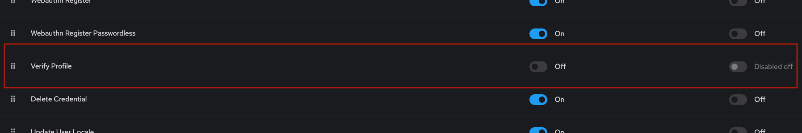
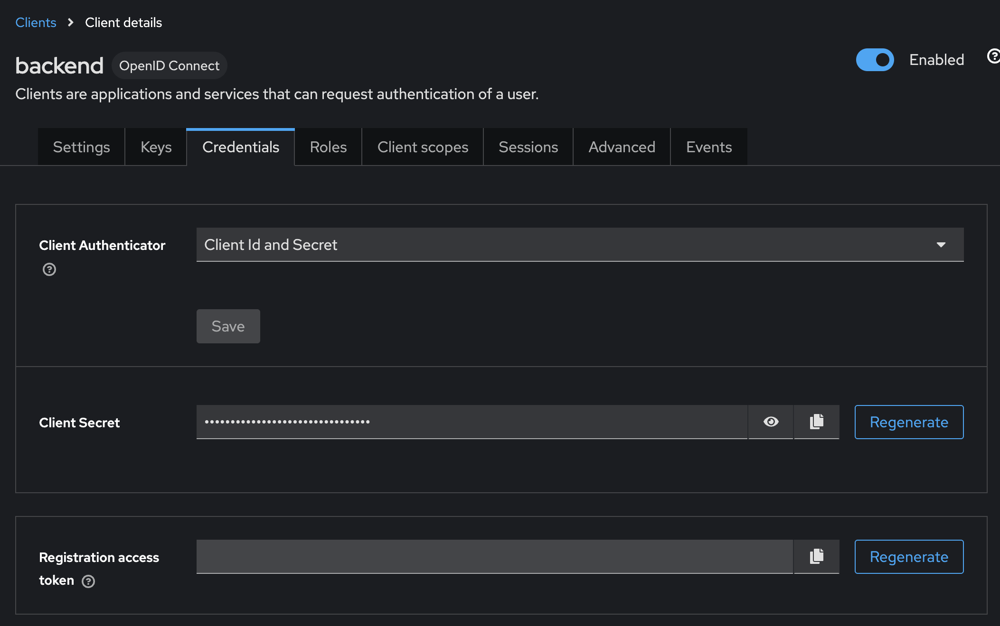

# Keycloak Instance Deployment

This guide walks you through the process of deploying and configuring a Keycloak instance to support authentication for Dataverse’s Single Page Application (SPA) built-in users.

### Download Keycloak

Install [Keycloak](https://www.keycloak.org/downloads.html) from the official website. Download a ZIP file that you'll need to place and unzip into the target instance.

### Download Required Oracle JDBC Libraries

Download the following JAR files from the URLs below, and place them in the `keycloak-26.X.X/providers` directory:

- [ojdbc11-23.8.0.25.04.jar](https://repo1.maven.org/maven2/com/oracle/database/jdbc/ojdbc11/23.8.0.25.04/ojdbc11-23.8.0.25.04.jar)
- [orai18n-23.8.0.25.04.jar](https://repo1.maven.org/maven2/com/oracle/database/nls/orai18n/23.8.0.25.04/orai18n-23.8.0.25.04.jar)

The `ojdbc11` JAR provides the actual JDBC driver required for database connectivity. The `orai18n` JAR provides additional character-set and localization support required by the driver in certain environments.

Both libraries are required for the Keycloak SPI you are going to install.

### Add Builtin Users SPI

Download the JAR file from [this link](https://github.com/IQSS/dataverse-frontend/blob/develop/dev-env/keycloak/keycloak-dv-builtin-users-authenticator-1.0-SNAPSHOT.jar) and place it in the `keycloak-26.X.X/providers` directory.

### Add Keycloak Custom Theme

First, make sure you have built the latest version of the design system, which is required for the custom Keycloak theme:

```bash
cd packages/design-system && npm run build
```

From the repository root run the following command to build the custom Keycloak theme:

```bash
npm run build-keycloak-theme
```

Copy the generated `dv-spa-kc-theme.jar` file to your Keycloak instance’s `keycloak-26.X.X/providers` directory.

### Create keycloak.conf

Inside the `keycloak-26.X.X/conf` directory, create a `keycloak.conf` file with the following database configuration, replacing the bracketed variables with the corresponding values for your environment.
(Note that the keycloak.conf file in dev-env is configured to use a file based H2 database for development purposes only. You will need to change the configuration to use a production database for your Keycloak instance. See below for more details.)

The first database block configures Keycloak's own database, which stores realm, client, session, and server state. The `user-store` named datasource block configures the Dataverse database connection used by the Builtin Users SPI.

```properties
# Keycloak server database.
db=postgres
db-url-full=jdbc:postgresql://<KEYCLOAK_DB_SERVER_IP>:<KEYCLOAK_DB_SERVER_PORT>/<KEYCLOAK_DB_NAME>
db-username=<KEYCLOAK_DB_USERNAME>
db-password=<KEYCLOAK_DB_PASSWORD>

# Dataverse Builtin Users SPI datasource.
db-kind-user-store=postgres
db-url-full-user-store=jdbc:postgresql://<DATAVERSE_DB_SERVER_IP>:<DATAVERSE_DB_SERVER_PORT>/<DATAVERSE_DB_NAME>
db-username-user-store=<DATAVERSE_DB_USERNAME>
db-password-user-store=<DATAVERSE_DB_PASSWORD>
db-driver-user-store=org.postgresql.Driver
transaction-xa-enabled-user-store=false
```

### Production Database Setup

Keycloak includes an embedded H2 database driver for development purposes only. Do not use H2 for production, and do not rely on the development-mode database files for a deployed Keycloak instance.

For production, create a dedicated relational database for Keycloak before starting the server. This database is separate from the Dataverse database used by the Builtin Users SPI.

For PostgreSQL, the setup is typically:

```sql
CREATE DATABASE keycloak;
CREATE USER keycloak WITH PASSWORD '<KEYCLOAK_DB_PASSWORD>';
GRANT ALL PRIVILEGES ON DATABASE keycloak TO keycloak;
\c keycloak
GRANT ALL ON SCHEMA public TO keycloak;
```

Then configure the Keycloak database connection in `keycloak.conf`:

```properties
db=postgres
db-url-full=jdbc:postgresql://<KEYCLOAK_DB_SERVER_IP>:<KEYCLOAK_DB_SERVER_PORT>/keycloak
db-username=keycloak
db-password=<KEYCLOAK_DB_PASSWORD>
```

### Create quarkus.properties

Inside the `keycloak-26.X.X/conf` directory, create a `quarkus.properties` file with the following transaction-manager setting.

```properties
quarkus.transaction-manager.unsafe-multiple-last-resources=allow
```

### SSL configuration

(Consult the "Production Deployment" section for a possible alternative configuration that allows to run Keycloak securely behind an https proxy, without having to enable SSL in Keycloak itself.)

To enable SSL in Keycloak, you first need to add the required SSL certificates and private keys to the instance. Specifically, the following files should be added:

- `/etc/ssl/certs/<CER_NAME>.cer`
- `/etc/pki/tls/private/<KEY_NAME>.key`

Remember to update these routes with your actual file names.

Please note that Keycloak requires that the certificate file above contains both the server certificate, and the issuer chain in the same file (in that order!). There are no options for configuring the 2 in separate files.

Once the certificate and key have been uploaded to the instance, you need to configure the following Keycloak environment variables:

- `KC_HTTPS_CERTIFICATE_FILE=/etc/ssl/certs/<CER_NAME>.cer`
- `KC_HTTPS_CERTIFICATE_KEY_FILE=/etc/pki/tls/private/<KEY_NAME>.key`
- `KC_HTTPS_ENABLED=true`
- `KC_HTTPS_PORT=443`

### Running Keycloak

For a production deployment, build the optimized Keycloak server after the configuration files and provider JARs are in place:

```bash
./bin/kc.sh build
```

Run Keycloak for the first time on the instance using the following command.

```bash
nohup ./bin/kc.sh start --optimized --bootstrap-admin-username tmpadm --bootstrap-admin-password pass --hostname https://<KEYCLOAK_DOMAIN> > keycloak.log 2>&1 &
```

This command will set up an admin user so you can log in and create a permanent one from the Keycloak Admin Console:  
`https://<KEYCLOAK_DOMAIN>/admin/master/console/`.

For subsequent executions of Keycloak, you can use the following command omitting the admin user bootstrapping parameters:

```bash
nohup ./bin/kc.sh start --optimized --hostname https://<KEYCLOAK_DOMAIN> > keycloak.log 2>&1 &
```

Note that the output logs of the command are saved in a file named `keycloak.log`.

### Create a Keycloak Realm

Create a realm in Keycloak from the Keycloak Admin Console:  
`https://<KEYCLOAK_DOMAIN>/admin/master/console/`.

Give it a descriptive name for the environment you are deploying, since this name will appear in the different URLs used for OIDC and other purposes.

### Enable Builtin Users SPI

Once you have created the realm, you need to enable the Builtin Users SPI within it. To do this, you can edit the following script with the admin credentials and realm name, and execute it.

```bash
#!/bin/sh

# Obtain admin token
ADMIN_TOKEN=$(curl -k -s -X POST "https://localhost:443/realms/master/protocol/openid-connect/token" \
  -H "Content-Type: application/x-www-form-urlencoded" \
  -d "username=<ADMIN_USERNAME>" \
  -d "password=<ADMIN_PASSWORD>" \
  -d "grant_type=password" \
  -d "client_id=admin-cli" | jq -r .access_token)
echo $ADMIN_TOKEN
# Create user storage provider using the components endpoint
curl -k -X POST "https://localhost:443/admin/realms/<REALM_NAME>/components" \
  -H "Authorization: Bearer $ADMIN_TOKEN" \
  -H "Content-Type: application/json" \
  -d '{
    "name": "Dataverse built-in users authentication",
    "providerId": "dv-builtin-users-authenticator",
    "providerType": "org.keycloak.storage.UserStorageProvider",
    "parentId": null,
    "config": {
      "datasource": ["user-store"]
    }
  }'

echo "Keycloak SPI configured in realm."
```

### Disable Profile Verification

For the SPI to work correctly and for Keycloak to rely on the user attributes coming from it, you need to disable the `Verify Profile` option under `Authentication > Required Actions` in the Realm-level configuration.



### Create a Keycloak client for the Dataverse SPA

To allow the SPA to authenticate with Keycloak using PKCE, we need to create a public OIDC client in the Keycloak realm.

You can create a JSON file based on the following example file, replacing the value of the dataverse domain name with that of your installation, and use the **Import Client** option in Keycloak to create the client from a JSON file.

```json
{
  "clientId": "spa",
  "name": "",
  "description": "",
  "rootUrl": "",
  "adminUrl": "",
  "baseUrl": "",
  "surrogateAuthRequired": false,
  "enabled": true,
  "alwaysDisplayInConsole": false,
  "clientAuthenticatorType": "client-secret",
  "redirectUris": ["https://<INSTALLATION_DOMAIN_NAME>/modern/*"],
  "webOrigins": ["+"],
  "notBefore": 0,
  "bearerOnly": false,
  "consentRequired": false,
  "standardFlowEnabled": true,
  "implicitFlowEnabled": false,
  "directAccessGrantsEnabled": true,
  "serviceAccountsEnabled": false,
  "publicClient": true,
  "frontchannelLogout": true,
  "protocol": "openid-connect",
  "attributes": {
    "realm_client": "false",
    "oidc.ciba.grant.enabled": "false",
    "backchannel.logout.session.required": "true",
    "post.logout.redirect.uris": "+",
    "oauth2.device.authorization.grant.enabled": "false",
    "backchannel.logout.revoke.offline.tokens": "false"
  },
  "authenticationFlowBindingOverrides": {},
  "fullScopeAllowed": true,
  "nodeReRegistrationTimeout": -1,
  "defaultClientScopes": ["web-origins", "acr", "roles", "profile", "basic", "email"],
  "optionalClientScopes": ["address", "phone", "offline_access", "microprofile-jwt"],
  "access": {
    "view": true,
    "configure": true,
    "manage": true
  }
}
```

You can also create the client from scratch using the Keycloak UI.

### Create a Keycloak client for the Dataverse Backend

In the case of the backend client, you will need to create a Keycloak OIDC confidential client.

Below is a JSON file that you can import to set up the client.

```json
{
  "clientId": "backend",
  "name": "",
  "description": "",
  "rootUrl": "",
  "adminUrl": "",
  "baseUrl": "",
  "surrogateAuthRequired": false,
  "enabled": true,
  "alwaysDisplayInConsole": false,
  "clientAuthenticatorType": "client-secret",
  "redirectUris": ["*"],
  "webOrigins": [],
  "notBefore": 0,
  "bearerOnly": false,
  "consentRequired": false,
  "standardFlowEnabled": true,
  "implicitFlowEnabled": false,
  "directAccessGrantsEnabled": true,
  "serviceAccountsEnabled": false,
  "publicClient": false,
  "frontchannelLogout": true,
  "protocol": "openid-connect",
  "attributes": {
    "realm_client": "false",
    "oidc.ciba.grant.enabled": "false",
    "client.secret.creation.time": "1747655394",
    "backchannel.logout.session.required": "true",
    "post.logout.redirect.uris": "+",
    "oauth2.device.authorization.grant.enabled": "false",
    "backchannel.logout.revoke.offline.tokens": "false"
  },
  "authenticationFlowBindingOverrides": {},
  "fullScopeAllowed": true,
  "nodeReRegistrationTimeout": -1,
  "defaultClientScopes": ["web-origins", "acr", "profile", "roles", "basic", "email"],
  "optionalClientScopes": [
    "address",
    "phone",
    "organization",
    "offline_access",
    "microprofile-jwt"
  ],
  "access": {
    "view": true,
    "configure": true,
    "manage": true
  }
}
```

You can also create the client from scratch using the Keycloak UI.

Once the client is created, you need to generate a client secret, which you will need to keep and use in the next installation step to register the OIDC provider in Dataverse.



You can test logging in with the newly created OIDC client, interacting with the Builtin Users SPI, using the following command:

```bash
curl -X POST \
  http://<KEYCLOAK_DOMAIN>/realms/<REALM_NAME>/protocol/openid-connect/token \
  -H "Content-Type: application/x-www-form-urlencoded" \
  -d "client_id=<CLIENT_ID>" \
  -d "client_secret=<CLIENT_SECRET>" \
  -d "grant_type=password" \
  -d "username=<DATAVERSE_USERNAME>" \
  -d "password=<DATAVERSE_PASSWORD>" \
  -d "scope=openid"
```

### Production Deployment

A common alternative configuration is to run Keycloak behind a reverse proxy (see [Configuring a reverse proxy](https://www.keycloak.org/server/reverseproxy) in the documentation).
This model was chosen for the initial production deployment of Keycloak at Harvard Dataverse Repository, where it has been placed behind Apache. This allows the admins to use the standard Apache mechanisms for access control and makes it easy to run other services behind the same Apache instance.

This actually simplifies the configuration of Keycloak itself, since it is not necessary to enable SSL - it can run on the default port 8080 with the https proxying provided by Apache or Nginx, etc.

The following configuration options must be enabled to facilitate this setup:

On the Keycloak level, the application must be started with the following options:
`--http-enabled=true --proxy-headers xforwarded`.
The configuration and the environmental variables described in the "SSL configuration" section must NOT be present.

On the Apache level, the following headers need to be enabled:

```
  ProxyRequests Off
  ProxyPreserveHost On
  RequestHeader set X-Forwarded-Proto "https"
  RequestHeader set X-Forwarded-Port "443"
```

Rewrite rules can be utilized to separate the Keycloak traffic from other services that may need to be provided by the Apache instance.
In the following example, everything with the exception of `/service1/*` and `/service2/*` is passed to Keycloak running on port 8080:

```
  ProxyPassMatch ^/service1/	!
  ProxyPassMatch ^/service2/	!
  ProxyPass / http://localhost:8080/
  ProxyPassReverse / http://localhost:8080/
```

(Note that the ProxyPass rules above can be further tightened, only allowing certain parts of KeyCloak to be exposed externally).

The following startup file (`/etc/systemd/system/keycloak.service`) has been created. Note that Keycloak runs under a dedicated non-root user, which is always recommended in production.

```
[Unit]
Description=Harvard IQSS Dataverse Keycloak Server
After=syslog.target network.target postgresql-16.service
Before=httpd.service
ConditionPathExists=/opt/dvn/keycloak/bin/keycloakstart.sh
Requires=postgresql-16.service

[Service]
User=keycloak
Group=keycloak
Type=forking
ExecStart=/opt/dvn/keycloak/bin/keycloakstart.sh
TimeoutStartSec=600
TimeoutStopSec=600
Restart=on-failure
LimitNOFILE=10240

[Install]
WantedBy=multi-user.target
```

`systemctl enable keycloak` to make sure Keycloak starts every time the instance boots.

Note that the systemd file above references another shell script, `/opt/dvn/keycloak/bin/keycloakstart.sh` that does the actual starting.

```
$ cat /opt/dvn/keycloak/bin/keycloakstart.sh
#!/bin/sh

export DIRECTORY=/opt/dvn/keycloak/current

nohup ${DIRECTORY}/bin/kc.sh start --hostname auth.dataverse.harvard.edu --optimized --http-enabled=true --proxy-headers xforwarded > /var/log/keycloak.log 2>&1 &
```

### Register the Keycloak Dataverse Backend OIDC client in Dataverse

Both the JVM options from this step and the next must be registered within the instance where your Dataverse installation is hosted.

For Keycloak OIDC client to work, we need to add the following options:

- `dataverse.auth.oidc.auth-server-url`
- `dataverse.auth.oidc.client-id`
- `dataverse.auth.oidc.client-secret`
- `dataverse.auth.oidc.enabled`

These variables must be set according to the data of the previously configured Keycloak client.

### Enable Dataverse OIDC Feature Flags

In the Dataverse instance, you need to enable different OIDC-related feature flags by setting the following JVM options:

- `dataverse.feature.api-bearer-auth`
- `dataverse.feature.api-bearer-auth-provide-missing-claims`
- `dataverse.feature.api-bearer-auth-use-builtin-user-on-id-match`

### Upgrades

This section implies a production, or a permanent test/demo etc. instance.
A developer will not be expected to need to upgrade a keycloak instance started as part of their personal dev. environment. It should be easier to simply start a new version from scratch.

The process below also assumes that an external PostgreSQL, or a similar database is used to store the realm(s) and users information. This way the database does not need to be exported and reimported into the new keycloak instance.

An upgrade from 26.7.0 to 26.7.2 is used in the command lines below. Adjust as needed (same for the directories used in the examples)

1. Build a new `builtin-users-spi` jar file; make sure the target keycloak version is reflected in the `pom.xml` and any extra user stores - if the keycloak instance serves more than one realm - are listed in the `persistence.xml` file.
2. Stop the old keycloak: `sudo systemctl stop keycloak`
3. If you want to be safe, back up the database (exercise for the user)
4. Download and unzip the new version and switch the link:

```
cd /usr/local/keycloak
sudo unzip /tmp/keycloak-26.7.2.zip
sudo rm current
sudo ln -s keycloak-26.7.2 current
```

5. Copy the new authenticator jar in place:
   `sudo cp /tmp/keycloak-dv-builtin-users-authenticator-1.0-SNAPSHOT.jar current/providers/`
6. Copy the other 3 jar files (assumes these have not changed and can be reused!)

```
sudo cp keycloak-26.7.0/providers/dv-spa-kc-theme.jar current/providers/
sudo cp keycloak-26.7.0/providers/ojdbc11-23.8.0.25.04.jar current/providers/
sudo cp keycloak-26.7.0/providers/orai18n-23.8.0.25.04.jar current/providers/
```

7. Copy the config files: (same assumption, that nothing has changed since the last version; consult the installation instruction to be sure)

```
sudo cp keycloak-26.7.0/conf/keycloak.conf current/conf/
sudo cp keycloak-26.7.0/conf/quarkus.properties current/conf/
```

8. Build:

```
cd current
sudo ./bin/kc.sh build
```

You can now start keycloak. Using the setup shown above, with the link `current` always pointing to the latest version, no changes should be needed to the startup.
None of the extra configuration steps described in the installation instructions are needed, since all the configuration information has been preserved in the database.
