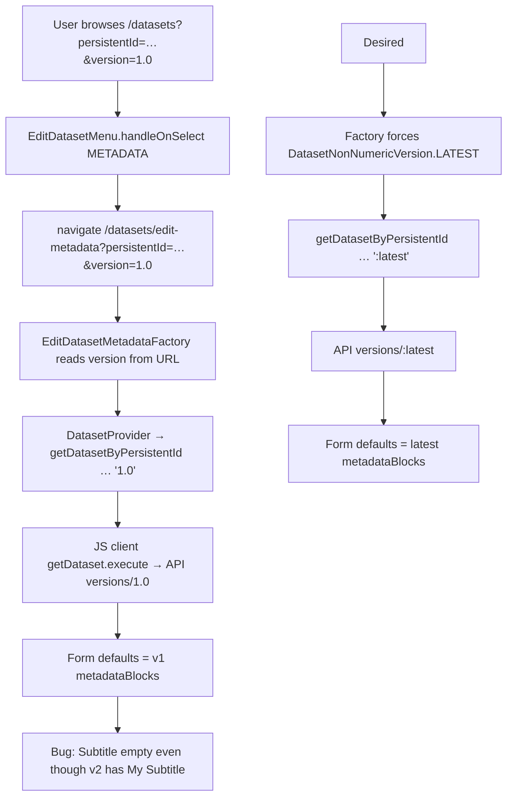

# Issue #1024 — Edit Metadata: should always pre-populate the latest metadata

| Field                     | Value                                                                                             |
| ------------------------- | ------------------------------------------------------------------------------------------------- |
| Status                    | **Implemented on branch `fix/1024-edit-metadata-latest-version`** — awaiting PR / upstream review |
| Labels                    | `bug`, `SPA`, `GREI Re-arch`, `Original size: 3`                                                  |
| Reporter                  | `ChengShi-1` (description from `@pdurbin`)                                                        |
| Issue URL                 | https://github.com/IQSS/dataverse-frontend/issues/1024                                            |
| Diagnosis baseline commit | `922dcfc` (`develop` tip when diagnosis was written)                                              |
| Fix branch                | `fix/1024-edit-metadata-latest-version`                                                           |
| Local package path        | `/Users/shihuayu/Documents/GitHub/dataverse-frontend`                                             |
| How to implement          | Follow §8 Steps 0–7; every fix must pass §10 acceptance criteria                                  |
| How to verify             | Follow §18 (commands + expected outputs). Do not merge without green AC1–AC6                      |

---

## 1. Executive summary

When a dataset has multiple published versions, the **legacy JSF** “Edit Metadata” flow always pre-fills the form from the **latest** metadata (draft if one exists, otherwise latest published), regardless of which version the user is currently viewing.

The **SPA** incorrectly pre-fills from the **version currently being browsed**. That version is written into the edit-page URL as `?version=…` and then used as the fetch target in `EditDatasetMetadataFactory`.

### Concrete failure (from the issue + Phil’s screenshot narrative)

| Version | Title        | Subtitle    |
| ------- | ------------ | ----------- |
| 1.0     | Test Dataset | _(empty)_   |
| 2.0     | Test Dataset | My Subtitle |

1. User opens the dataset page for **Version 1.0**.
2. User clicks **Edit Dataset → Metadata**.
3. **JSF (correct):** form shows Subtitle = `My Subtitle` (latest).
4. **SPA (bug):** form shows Subtitle empty (version 1.0).

### Risk

If the user saves from a form that was initialized with older metadata, they can **overwrite newer field values** on the draft that editing creates/updates — silent data loss relative to the latest published content.

### Root cause (one sentence)

`EditDatasetMetadataFactory` passes the URL `version` query param into `DatasetProvider` / `getDatasetByPersistentId`, instead of forcing `DatasetNonNumericVersion.LATEST` (`:latest`) the way `EditDatasetTermsFactory` already does.

### Recommended fix (one sentence)

In `EditDatasetMetadataFactory.tsx`, ignore the browsed `version` search param and always load `DatasetNonNumericVersion.LATEST`, matching Edit Terms; add regression tests for “enter Edit Metadata while viewing an older published version.”

---

## 2. Expected vs actual behavior

### 2.1 Product expectation (JSF parity)

| User context                                       | Click “Edit Metadata” | Form must show                                                               |
| -------------------------------------------------- | --------------------- | ---------------------------------------------------------------------------- |
| Viewing published `1.0` while `2.0` exists         | Edit Metadata         | Metadata of **latest** (`:latest` → draft if present, else latest published) |
| Viewing published `2.0` (already latest published) | Edit Metadata         | Same latest metadata (no regression)                                         |
| Viewing / working on `DRAFT`                       | Edit Metadata         | Draft metadata (`:latest` resolves to draft when present)                    |

**Important semantic of `:latest` in Dataverse:** draft if a draft exists; otherwise the latest published version. This is exactly what the Edit Terms factory comment documents and what JSF edit-metadata behavior matches.

### 2.2 SPA actual behavior today

| User context  | URL after menu click                           | Dataset fetch version | Form                                                            |
| ------------- | ---------------------------------------------- | --------------------- | --------------------------------------------------------------- |
| Viewing `1.0` | `.../edit-metadata?persistentId=…&version=1.0` | `1.0`                 | Old metadata                                                    |
| Viewing `2.0` | `...&version=2.0`                              | `2.0`                 | Happens to look correct if 2.0 is latest published and no draft |
| Viewing draft | `...&version=DRAFT` → domain `:draft`          | `:draft`              | Draft (often OK, but still “browsed version” coupling)          |

---

## 3. Architecture context (where this lives)

```text
Dataset page (browse any version)
  └─ DatasetActionButtons
       └─ EditDatasetMenu  ──navigate──►  /datasets/edit-metadata?persistentId&version
                                              │
                                              ▼
                                    EditDatasetMetadataFactory
                                              │
                                              ▼
                                    DatasetProvider(getDatasetByPersistentId)
                                              │
                                              ▼
                                    DatasetJSDataverseRepository.getByPersistentId
                                              │
                                              ▼
                                    @iqss/dataverse-client-javascript getDataset.execute
                                              │
                                              ▼
                                    Native API: GET .../versions/{versionId}
                                              │
                                              ▼
                                    EditDatasetMetadata
                                              │
                                              ▼
                                    DatasetMetadataForm(mode="edit")
                                         defaults ← dataset.metadataBlocks
```

The form component is **not** the bug. It faithfully displays whatever `dataset.metadataBlocks` it receives. The bug is **which version is fetched** before the form mounts.

---

## 4. Verified call chain (with file:line evidence)

All line numbers refer to local tree at commit `922dcfc` unless noted.

### 4.1 Route

| Item               | Location                                                                                              |
| ------------------ | ----------------------------------------------------------------------------------------------------- |
| Path enum          | `src/sections/Route.enum.ts` — `EDIT_DATASET_METADATA = '/datasets/edit-metadata'` (line 12)          |
| Query keys         | `QueryParamKey.VERSION = 'version'`, `PERSISTENT_ID = 'persistentId'` (lines 96–98 area)              |
| Route registration | `src/router/routes.tsx` — lazy `EditDatasetMetadataFactory.create()` on `Route.EDIT_DATASET_METADATA` |

### 4.2 Navigation (contributes browsed version into the URL)

File: `src/sections/dataset/dataset-action-buttons/edit-dataset-menu/EditDatasetMenu.tsx`

```39:55:src/sections/dataset/dataset-action-buttons/edit-dataset-menu/EditDatasetMenu.tsx
  const handleOnSelect = (eventKey: EditDatasetMenuItems | string | null) => {
    const searchParams = new URLSearchParams()
    searchParams.set(QueryParamKey.PERSISTENT_ID, dataset.persistentId)

    if (dataset.version.publishingStatus === DatasetPublishingStatus.DRAFT) {
      searchParams.set(QueryParamKey.VERSION, DatasetNonNumericVersionSearchParam.DRAFT)
    } else {
      searchParams.set(QueryParamKey.VERSION, dataset.version.number.toString())
    }
    // ...
    if (eventKey === EditDatasetMenuItems.METADATA) {
      navigate(`${Route.EDIT_DATASET_METADATA}?${searchParams.toString()}`)
      return
    }
```

When the user is viewing published version `1.0`, this navigates to:

```text
/datasets/edit-metadata?persistentId=<doi>&version=1.0
```

**Note:** The same menu also sets `version` for Terms and Upload Files. Edit **Terms** already ignores URL version in its factory (see §5). Upload Files may still need a version-aware URL — do **not** globally remove version from the menu without checking upload behavior.

### 4.3 Factory (bug site — consumes URL version)

File: `src/sections/edit-dataset-metadata/EditDatasetMetadataFactory.tsx`

```18:30:src/sections/edit-dataset-metadata/EditDatasetMetadataFactory.tsx
function EditDatasetMetadataWithParams() {
  const [searchParams] = useSearchParams()
  const persistentId = searchParams.get('persistentId') ?? undefined
  const searchParamVersion = searchParams.get('version') ?? undefined
  const version = searchParamVersionToDomainVersion(searchParamVersion)

  return (
    <DatasetProvider
      repository={datasetRepository}
      searchParams={{ persistentId: persistentId, version: version }}>
      <EditDatasetMetadata metadataBlockInfoRepository={metadataBlockInfoRepository} />
    </DatasetProvider>
  )
}
```

`searchParamVersionToDomainVersion` (`src/router/index.tsx` lines 11–17) only special-cases `DRAFT` → `:draft`; numeric versions like `1.0` pass through unchanged.

### 4.4 Provider → use case → repository

| Step       | File                                                                               | Behavior                                                                                          |
| ---------- | ---------------------------------------------------------------------------------- | ------------------------------------------------------------------------------------------------- |
| Provider   | `src/sections/dataset/DatasetProvider.tsx` ~28–36                                  | Calls `getDatasetByPersistentId(repository, persistentId, searchParams.version, undefined, true)` |
| Use case   | `src/dataset/domain/useCases/getDatasetByPersistentId.ts`                          | Delegates to repository                                                                           |
| Repository | `src/dataset/infrastructure/repositories/DatasetJSDataverseRepository.ts` ~213–220 | `getDataset.execute(persistentId, version, …)` via JS client                                      |

Default for `getByPersistentId` when version omitted is `DatasetNonNumericVersion.LATEST_PUBLISHED` (`:latest-published`) — but the factory **does not omit** version; it passes the browsed one explicitly.

### 4.5 Form initialization (downstream, correct given inputs)

File: `src/sections/edit-dataset-metadata/EditDatasetMetadata.tsx` ~61–68

```61:68:src/sections/edit-dataset-metadata/EditDatasetMetadata.tsx
            <DatasetMetadataForm
              mode="edit"
              collectionId={datasetParentCollection?.id}
              metadataBlockInfoRepository={metadataBlockInfoRepository}
              datasetPersistentID={dataset.persistentId}
              datasetMetadaBlocksCurrentValues={dataset.metadataBlocks}
              datasetLastUpdateTime={dataset.version.lastUpdateTime}
            />
```

`DatasetMetadataForm` builds defaults via `MetadataFieldsHelper.getFormDefaultValues(...)` from those blocks (`src/sections/shared/form/DatasetMetadataForm/index.tsx`).

### 4.6 Version domain constants

File: `src/dataset/domain/models/Dataset.ts` ~210–217

```210:217:src/dataset/domain/models/Dataset.ts
export enum DatasetNonNumericVersion {
  LATEST = ':latest',
  DRAFT = ':draft',
  LATEST_PUBLISHED = ':latest-published'
}
export enum DatasetNonNumericVersionSearchParam {
  DRAFT = 'DRAFT'
}
```

| Constant           | API `versionId`     | Meaning                                                                 |
| ------------------ | ------------------- | ----------------------------------------------------------------------- |
| `LATEST`           | `:latest`           | Draft if exists, else latest published — **use this for Edit Metadata** |
| `DRAFT`            | `:draft`            | Draft only                                                              |
| `LATEST_PUBLISHED` | `:latest-published` | Latest published only (skips draft)                                     |

**Do not** use `:latest-published` for Edit Metadata: if a draft already exists with newer edits, editors must see the draft.

---

## 5. Proven correct pattern already in this repo (Edit Terms)

File: `src/sections/edit-dataset-terms/EditDatasetTermsFactory.tsx`

```19:29:src/sections/edit-dataset-terms/EditDatasetTermsFactory.tsx
function EditDatasetTermsWithSearchParams() {
  const [searchParams] = useSearchParams()
  const defaultActiveTabKey = EditDatasetTermsHelper.defineSelectedTabKey(searchParams)
  const persistentId = searchParams.get('persistentId') ?? undefined
  // Always load the latest version (draft if exists, otherwise latest published)
  const version = DatasetNonNumericVersion.LATEST

  return (
    <DatasetProvider
      repository={datasetRepository}
      searchParams={{ persistentId: persistentId, version: version }}>
```

Edit Terms receives the same menu URL shape (including `version=1.0`) but **ignores** it. Edit Metadata should do the same. This is the strongest in-repo proof that the intended SPA product behavior is “always `:latest` for edit screens.”

---

## 6. End-to-end bug flowchart



---

## 7. Specific solution (what to change)

### 7.1 Primary fix (required) — Factory always uses `:latest`

**File:** `src/sections/edit-dataset-metadata/EditDatasetMetadataFactory.tsx`  
**Function:** `EditDatasetMetadataWithParams`

**Replace** the version extraction:

```tsx
const searchParamVersion = searchParams.get('version') ?? undefined
const version = searchParamVersionToDomainVersion(searchParamVersion)
```

**With** (mirror Edit Terms):

```tsx
import { DatasetNonNumericVersion } from '@/dataset/domain/models/Dataset'
// or relative import consistent with this file's style

// Always load the latest version (draft if exists, otherwise latest published)
const version = DatasetNonNumericVersion.LATEST
```

**Remove** unused imports after the change (`searchParamVersionToDomainVersion` if no longer referenced).

**Why this is the right primary fix**

1. Matches JSF expectation stated in #1024.
2. Matches existing SPA Edit Terms pattern.
3. Fixes **deep links** to `/edit-metadata?...&version=1.0`, not only menu clicks.
4. Does not break the dataset **browse** page (which must still load the selected version).
5. Does not change `DatasetProvider` or repository defaults globally (avoids collateral damage).

### 7.2 Optional cleanup — Menu URL for METADATA

Optionally stop attaching a numeric `version` when navigating to Edit Metadata (Terms already ignores it). **Optional only** after Factory fix is in place; not required for correctness once Factory forces `:latest`.

If you change the menu, keep Upload Files behavior reviewed separately — it still sets version for a reason.

### 7.3 Explicitly out of scope / do not change

| Do not                                       | Why                                       |
| -------------------------------------------- | ----------------------------------------- |
| Change browse-page version loading           | Users must still view historical versions |
| Change `DatasetProvider` to always latest    | Shared by browse + edit                   |
| Change form defaulting helpers               | They are correct given inputs             |
| Use `:latest-published` instead of `:latest` | Misses existing draft content             |
| Redesign Edit Metadata UI                    | Issue is data-fetching only               |

### 7.4 Save / update path (sanity)

After submit, navigation already targets draft (see `useSubmitDataset.ts` navigating with `VERSION=DRAFT`). Prefill must therefore also be latest/draft-aware so the user edits the same lineage they will save into. No change required there for #1024 if Factory uses `:latest`.

---

## 8. Implementation playbook (Steps 0–7)

### Step 0 — Baseline (broken)

1. Use a dataset with ≥2 published versions where a field differs (e.g. subtitle added in v2).
2. Open SPA dataset page with `version=1.0`.
3. Edit Dataset → Metadata.
4. **Observe:** form shows v1 values (subtitle empty).
5. Optionally compare same click path on JSF: subtitle present.

Record URL query string and network call version id (`1.0` vs `:latest`).

### Step 1 — Apply Factory fix

Edit `EditDatasetMetadataFactory.tsx` as in §7.1.

### Step 2 — Manual verify (happy paths)

| Case | Steps                                                                                  | Expected                                       |
| ---- | -------------------------------------------------------------------------------------- | ---------------------------------------------- |
| A    | Browse v1 → Edit Metadata                                                              | Latest fields (e.g. subtitle from v2 or draft) |
| B    | Browse latest published → Edit Metadata                                                | Same latest fields (no regression)             |
| C    | With an existing draft that changed a field → Edit Metadata from any published version | Draft values appear (`:latest`)                |
| D    | Direct URL `/edit-metadata?persistentId=…&version=1.0`                                 | Still loads `:latest`, not `1.0`               |

### Step 3 — Automated tests

Existing coverage gaps (verified):

| File                                                                                    | Current focus                                                              | Gap                                                             |
| --------------------------------------------------------------------------------------- | -------------------------------------------------------------------------- | --------------------------------------------------------------- |
| `tests/component/sections/edit-dataset-metadata/EditDatasetMetadata.spec.tsx`           | Breadcrumbs / skeleton / not-found; `searchParams = { persistentId }` only | No assertion that fetch uses `:latest` when URL has old version |
| `tests/e2e-integration/e2e/sections/edit-dataset-metadata/EditDatasetMetadata.spec.tsx` | Visits with `version=DRAFT` only                                           | No multi-version “from old published version” case              |
| `tests/component/.../EditDatasetMenu.spec.tsx`                                          | Menu click                                                                 | Does not assert fetch version                                   |

**Add at least one of:**

1. **Component / unit (preferred minimal):** Mount or exercise `EditDatasetMetadataFactory` (or route) with  
   `?persistentId=…&version=1.0`  
   and assert the repository `getByPersistentId` was called with `DatasetNonNumericVersion.LATEST` (`:latest`), **not** `"1.0"`.

2. **E2E (strongest product proof):**

   - Create dataset, publish v1 without subtitle.
   - Add subtitle, publish v2.
   - Visit dataset with `version=1.0`.
   - Open Edit Metadata.
   - Assert subtitle input shows v2 value.

3. **Regression:** From latest version / draft, Edit Metadata still works (existing e2e paths should remain green).

### Step 4 — Lint / typecheck / affected tests

Run the project’s standard checks for touched files (per `CONTRIBUTING.md` / CI). At minimum run the edit-metadata component and e2e specs you touched.

### Step 5 — PR description checklist

- Link #1024
- State: “Always load `:latest` in `EditDatasetMetadataFactory`, matching `EditDatasetTermsFactory` and JSF.”
- Note: browse page version selection unchanged
- List test cases added

### Step 6 — Definition of done

See §10.

### Step 7 — Evidence to attach

- Before/after screenshots (v1 browse → Edit Metadata subtitle)
- Network panel showing `versions/:latest` (or equivalent JS client version arg)
- Test output

---

## 9. Suggested patch sketch (illustrative)

```tsx
// EditDatasetMetadataFactory.tsx — after fix
import { ReactElement } from 'react'
import { useSearchParams } from 'react-router-dom'
import { EditDatasetMetadata } from './EditDatasetMetadata'
import { DatasetProvider } from '../dataset/DatasetProvider'
import { DatasetJSDataverseRepository } from '../../dataset/infrastructure/repositories/DatasetJSDataverseRepository'
import { MetadataBlockInfoJSDataverseRepository } from '../../metadata-block-info/infrastructure/repositories/MetadataBlockInfoJSDataverseRepository'
import { DatasetNonNumericVersion } from '../../dataset/domain/models/Dataset'

const datasetRepository = new DatasetJSDataverseRepository()
const metadataBlockInfoRepository = new MetadataBlockInfoJSDataverseRepository()

export class EditDatasetMetadataFactory {
  static create(): ReactElement {
    return <EditDatasetMetadataWithParams />
  }
}

function EditDatasetMetadataWithParams() {
  const [searchParams] = useSearchParams()
  const persistentId = searchParams.get('persistentId') ?? undefined
  // Always load the latest version (draft if exists, otherwise latest published)
  // See EditDatasetTermsFactory and IQSS/dataverse-frontend#1024
  const version = DatasetNonNumericVersion.LATEST

  return (
    <DatasetProvider
      repository={datasetRepository}
      searchParams={{ persistentId: persistentId, version: version }}>
      <EditDatasetMetadata metadataBlockInfoRepository={metadataBlockInfoRepository} />
    </DatasetProvider>
  )
}
```

Import path style should match surrounding files (`@/` vs relative) — keep consistency with this module / Edit Terms.

---

## 10. Acceptance criteria (verifiable)

| #   | Criterion                                                                     | How to verify                          |
| --- | ----------------------------------------------------------------------------- | -------------------------------------- |
| AC1 | From an older published version, Edit Metadata shows **latest** field values  | Manual case A + e2e                    |
| AC2 | Deep link with `version=<old>` still loads latest                             | Manual case D + unit spy on repository |
| AC3 | From latest published / draft, Edit Metadata unchanged / correct              | Manual B/C + existing e2e              |
| AC4 | Dataset **browse** of historical versions still shows that version’s metadata | Browse v1 page still empty subtitle    |
| AC5 | Implementation aligns with Edit Terms (`DatasetNonNumericVersion.LATEST`)     | Code review                            |
| AC6 | Automated regression exists for AC1 or AC2                                    | CI green on new test                   |

---

## 11. API mapping (for debugging)

The SPA uses `@iqss/dataverse-client-javascript` `getDataset.execute(persistentId, version, …)`, which maps to Dataverse Native API:

```text
GET /api/datasets/:persistentId/versions/:versionId?persistentId=...
```

| Scenario                         | `versionId` today (bug) | `versionId` after fix        |
| -------------------------------- | ----------------------- | ---------------------------- |
| Browsing v1, click Edit Metadata | `1.0`                   | `:latest`                    |
| Draft exists                     | often `:draft` via menu | `:latest` (→ draft)          |
| Latest published, no draft       | `N.M`                   | `:latest` (→ that published) |

When debugging in DevTools, confirm the version segment or client argument — not only the form UI.

---

## 12. Test plan matrix

| ID  | Type           | Setup                                          | Action                           | Expect                              |
| --- | -------------- | ---------------------------------------------- | -------------------------------- | ----------------------------------- |
| T1  | Manual         | v1 no subtitle, v2 has subtitle                | Browse v1 → Edit Metadata        | Subtitle = v2 value                 |
| T2  | Manual         | Same                                           | Browse v2 → Edit Metadata        | Subtitle = v2 value                 |
| T3  | Manual         | Draft edits subtitle further                   | Browse v1 → Edit Metadata        | Subtitle = draft value              |
| T4  | Manual         | Open `/edit-metadata?persistentId&version=1.0` | Load page                        | Same as latest, not v1              |
| T5  | Unit/component | Mock repository                                | Mount factory with `version=1.0` | `getByPersistentId(..., ':latest')` |
| T6  | E2E            | Publish two versions                           | Automate T1                      | Pass                                |
| T7  | Regression     | Existing draft edit e2e                        | Run suite                        | Still pass                          |

---

## 13. Risks and edge cases

| Risk                                       | Mitigation                                                                                                                                            |
| ------------------------------------------ | ----------------------------------------------------------------------------------------------------------------------------------------------------- |
| Confusing `:latest` vs `:latest-published` | Use `LATEST` only; document draft preference                                                                                                          |
| Menu still puts old version in URL         | Harmless after Factory fix; optional cleanup                                                                                                          |
| Permissions / deaccessioned versions       | Existing menu disable / permission checks unchanged; retest if deaccessioned latest                                                                   |
| Private URL datasets                       | Factory path uses `persistentId`; private-URL browse uses different provider entry — confirm Edit Metadata entry points still go through this factory |
| Concurrent draft from another user         | Pre-existing conflict handling via `datasetLastUpdateTime` / API; out of scope for #1024                                                              |

---

## 14. Relationship to JSF (issue text)

Quoted expectation from #1024 / `@pdurbin`:

> In JSF, when you click "Edit Metadata", the latest metadata is pre-populated, no matter which version you're on. In the SPA, if I click "Edit Metadata" on version 1, the metadata from that version is pre-populated.

There is **no** separate SPA design doc required: JSF behavior + Edit Terms factory are the specifications.

---

## 15. Work estimate note

Label **Original size: 3** fits: one focused factory change (and optional menu cleanup) plus tests. Risk is low if scope stays at Factory + tests and avoids global provider changes.

---

## 16. Checklist for the implementer

- [ ] Reproduce on SPA with multi-version dataset (Step 0)
- [ ] Change `EditDatasetMetadataFactory` to `DatasetNonNumericVersion.LATEST`
- [ ] Remove unused imports
- [ ] Manual cases A–D
- [ ] Add unit/component and/or e2e regression
- [ ] Confirm browse historical version still shows historical metadata
- [ ] Open PR linking #1024 with before/after evidence

---

## 17. Implementation record (this branch)

| Change           | Path                                                                                 | What changed                                                                                                 |
| ---------------- | ------------------------------------------------------------------------------------ | ------------------------------------------------------------------------------------------------------------ |
| Factory fix      | `src/sections/edit-dataset-metadata/EditDatasetMetadataFactory.tsx`                  | Ignore URL `version`; always pass `DatasetNonNumericVersion.LATEST` (`:latest`) into `DatasetProvider`       |
| Regression tests | `tests/component/sections/edit-dataset-metadata/EditDatasetMetadataFactory.spec.tsx` | Assert `getByPersistentId` is called with `:latest` when URL has `version=1.0`, and when URL omits `version` |
| This doc         | `docs/issues/1024-edit-metadata-latest-version.md`                                   | Diagnosis + playbook + verification                                                                          |

**Not changed (intentionally):**

- Dataset browse page version loading
- `EditDatasetMenu` URL construction (harmless after Factory fix; Terms already ignored URL version)
- `DatasetProvider` / repository defaults
- Form defaulting helpers

---

## 18. Verification instructions (must pass before PR)

Every claim below is falsifiable. Record pass/fail.

### 18.1 Automated (required)

From repo root, with dependencies installed (`npm ci` if needed):

```bash
# Focused regression for #1024
npx cypress run --component --spec \
  tests/component/sections/edit-dataset-metadata/EditDatasetMetadataFactory.spec.tsx

# Existing edit-metadata component suite (no regressions)
npx cypress run --component --spec \
  tests/component/sections/edit-dataset-metadata/EditDatasetMetadata.spec.tsx
```

**Pass criteria:**

| Spec                                  | Expect                                                                                     |
| ------------------------------------- | ------------------------------------------------------------------------------------------ |
| `EditDatasetMetadataFactory.spec.tsx` | Both tests green: call uses `:latest` / `DatasetNonNumericVersion.LATEST`, **not** `"1.0"` |
| `EditDatasetMetadata.spec.tsx`        | All existing tests still green                                                             |

**Fail if:** `getByPersistentId` is invoked with `"1.0"` for the old-version URL case.

### 18.2 Manual product check (required for AC1)

Prerequisite: dataset with ≥2 published versions where a field differs (e.g. title or subtitle added in v2).

| Step | Action                                                           | Expected (pass)                                           | Fail if                   |
| ---- | ---------------------------------------------------------------- | --------------------------------------------------------- | ------------------------- |
| M1   | Open SPA dataset with `?version=1.0`                             | Browse page shows v1 content                              | —                         |
| M2   | Edit Dataset → Metadata                                          | Network/API version is `:latest` (or draft via `:latest`) | Request is for `1.0`      |
| M3   | Inspect form field that differs in v2                            | Shows **latest** value                                    | Shows empty / v1 value    |
| M4   | Open Edit Metadata from latest published                         | Same latest values                                        | Regression / blank form   |
| M5   | If a draft exists with further edits, open Edit Metadata from v1 | Form shows **draft** values (`:latest`)                   | Shows published-only / v1 |

### 18.3 Negative control (browse must stay historical)

| Step | Action                                      | Expected                                                |
| ---- | ------------------------------------------- | ------------------------------------------------------- |
| N1   | Stay on browse `?version=1.0` (do not edit) | Historical metadata still shown (e.g. missing subtitle) |

If N1 fails, the fix was applied too broadly (e.g. Provider always latest) — revert and keep the change only in `EditDatasetMetadataFactory`.

### 18.4 Code review checklist

- [ ] Factory uses `DatasetNonNumericVersion.LATEST` only
- [ ] No use of `:latest-published` for this page
- [ ] Comment references #1024 / Edit Terms parity
- [ ] Unused `searchParamVersionToDomainVersion` import removed from Factory
- [ ] New component spec committed

---

## 19. Document history

| Date       | Commit / branch                         | Notes                                                       |
| ---------- | --------------------------------------- | ----------------------------------------------------------- |
| 2026-07-31 | `922dcfc` on `develop`                  | Diagnosis + solution written from source                    |
| 2026-07-31 | `fix/1024-edit-metadata-latest-version` | Factory fix + component regression tests + verification §18 |
